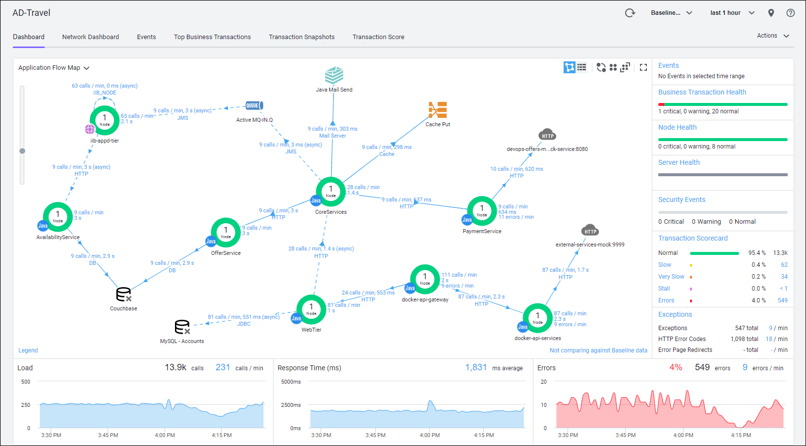

# **AppD-AWS-AppRegistry**

Prototype utility of an [AppDynamics](https://www.appdynamics.com) integration with [AWS AppRegistry](https://aws.amazon.com/blogs/mt/increase-application-visibility-governance-using-aws-service-catalog-appregistry/).  It can be used to pull the meta-data of one or more applications from an AppDynamics Controller and push it to the AppRegistry.

<br>

## **Dependecies** 

- Java 1.8
  - Needed to run the utility Jar file [AppD-AWS-AppRegistry.jar](https://github.com/Appdynamics/AppD-AWS-AppRegistry/blob/main/AppD-AWS-AppRegistry.jar)
- AWS Account
  - An AWS user in the account with appropriate permissions for AppRegistry  
- Maven - ( Optional )
  - Used for re-building the Jar file 

<br>

## **Usage** 

The utility Jar file uses the list of application names along with the connection details for an AppDynamics Controller that are defined in the [application-config.yaml](https://github.com/Appdynamics/AppD-AWS-AppRegistry/blob/main/application-config.yaml) configuration file.

The utiltiy Jar file can be run with one of the two supported options:

- **Create**
  - The create option pulls the meta-data of the applications defined in the configuration file from the AppDynamics Controller defined in the configuration file and publishes that data to AppRegistry.
- **List**
  - The list option simply lists the details of all the applications contained within AppRegistry.

<br>

## **Configuration File**

The configuration file is where you define the following:

- Connection details to the AppDynamics Controller
  -  controllerAccount:
  -  controllerUsername:
  -  controllerPassword:
  -  controllerPort:
  -  controllerSslEnabled:
  
- The list of application names to publish to AppRegistry
  -  applicationNames:
  
- The option to add the AppDynamics Id of the application to the application name when publishing to AppRegistry
  - addAppIdToAppName:


*Example Configuration File:*
```bash
!!com.appdynamics.cloud.aws.appregistry.ApplicationConfig

controllerAccount: "mydemo"
controllerUsername: "demouser1"
controllerPassword: "demouser1pwd123"
controllerHostName: "mydemo.saas.appdynamics.com"
controllerPort: 443
controllerSslEnabled: true

applicationNames:
  - AD-Travel
  - Ecommerce
  - AD-Movie Tickets Core

addAppIdToAppName: false
```

**Note:** At the time this utility was created, AppRegistry had specific naming conventions for the name of each application and each attribute group.  To accomodate this, the utility converts any dash characters and space characters found in the application name as it is defined within AppDynamics, with the underscore character when it publishes the application meta-data to AppRegistry.

<br>

## **Create Functionality**

The utility connects to the AppDynamics Controller defined in the configuration file (**application-config.yaml**) and then retrieves a list of applications in the Controller.  If any of the application names match one of the application names defined in the configuration file then the utility publishes the data for that application to AppRegistry.

Below is an example command that executes the utility with the create action to publish the applications defined in the configuration file specified.  Adjust the path to the configuration file and the utility Jar file to specify the appropriate locations for both.


*Example command for the create action:*

```bash
java -DappConfigFilePath=/home/ec2-user/application-config.yaml -DappAction=create -jar /home/ec2-user/AppD-AWS-AppRegistry.jar
```

<br>

The specific data published for an application and its components are as follows:

### **Application Level Data:**

This data is found either in the top level [Application](https://docs.aws.amazon.com/AWSJavaSDK/latest/javadoc/com/amazonaws/services/appregistry/model/Application.html) object within the AppRegistry once published or in the tags associated with it.

<br>

| Attribute Name | Description                                  | Attribute Source | Attribute Type |
| :------------- | :------------------------------------------- | :--------------: | :------------: |
| App Name | The name of the application with naming convention conversions | Controller | App Attribute |
| App Id | The id of the application generated by AppRegistry   | AppRegistry | App Attribute |
| App Description | The description of the application as found in the Controller | Controller | App Attribute |
| App ARN | The Amazon resource name (ARN) that specifies the application across services | AppRegistry | App Attribute |
| Associated Resource Count | The number of top-level resources that were registered as part of this application | AppRegistry | App Attribute |
| Creation Time | The ISO-8601 formatted timestamp of the moment when the application was created | AppRegistry | App Attribute |
| Last Update Time | The ISO-8601 formatted timestamp of the moment when the application was last updated | AppRegistry | App Attribute |
| APPD_APP_NAME | The name of the application as defined in the AppDynamics Controller | Controller | App Tag |
| APPD_APP_ID | The id of the application as defined in the AppDynamics Controller | Controller | App Tag |
| APPD_APP_CONTROLLER_HOST | The host name of the AppDynamics Controller this application is reporting to | Controller | App Tag |
| APPD_APP_NUMBER_OF_TIERS | The number of tiers contained in this application | Controller | App Tag |
| APPD_APP_NUMBER_OF_NODES | The number of nodes contained in this application | Controller | App Tag |

<br>

### **Attribute Group Level Data:**

This data is found in the [AttributeGroup](https://docs.aws.amazon.com/AWSJavaSDK/latest/javadoc/com/amazonaws/services/appregistry/model/AttributeGroup.html) object within the AppRegistry once published.  The utility creates only one AttributeGroup for each Application created.  

<br>

| Attribute Name | Description                                  | Attribute Source | Attribute Type |
| :------------- | :------------------------------------------- | :--------------: | :------------: |
| Group Name | The name of the attribute group, similarly named after the application | Controller | Group Attribute |
| Group Id | The id of the attribute group generated by AppRegistry | AppRegistry | Group Attribute |
| Group Description | The description of the attribute group | Controller | Group Attribute |
| Group ARN | The Amazon resource name (ARN) that specifies the attribute group across services | AppRegistry | Group Attribute |
| Group Attributes | The JSON representation of the application with its tiers and nodes | Controller | Group Attribute |


<br>




<br>

## **List Functionality**

Below is an example command that executes the utility with the list action that lists all the applications defined in the AppRegistry.  Adjust the path to the configuration file and the utility Jar file to specify the appropriate locations for both.

*Example command for the list action:*

```bash
java -DappConfigFilePath=/home/ec2-user/application-config.yaml -DappAction=list -jar /home/ec2-user/AppD-AWS-AppRegistry.jar
```

<br>
